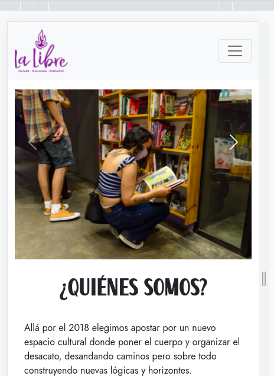
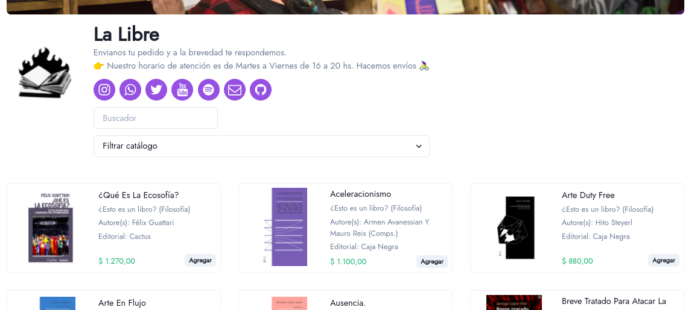

Entre finales de 2020 y principios de 2021, entre aislamiento, cuarentena, aburrimiento, curiosidad e internet, dediqué una buena cantidad de horas a aprender y experimentar con desarrollo web (html5, scss, [bootstrap](https://getbootstrap.com), hasta ahí).  
Para ir aplicando lo aprendido, armé una landing muy sencilla y una tienda (fork de [Pency](https://github.com/goncy/pency)) para la librería [La Libre](https://www.instagram.com/la__libre):

<!-- Esto no es markdown puro pero fue la forma más rápida que encontré para centrar la imagen
https://gist.github.com/DavidWells/7d2e0e1bc78f4ac59a123ddf8b74932d
https://github.com/DavidAnson/markdownlint/blob/v0.25.1/doc/Rules.md#md033---inline-html -->

  

[Landing Web](https://lalibrecf.com.ar){: .btn .btn-primary .fs-5 .mb-4 .mb-md-0 .mr-2 target="_blank" }
[Repositorio Web](https://gitlab.com/diegobollini/web-la-libre){: .btn .btn-blue target="_blank" }  

  

[Tienda web](https://tienda.lalibrecf.com.ar/){: .btn .btn-primary .btn-green .fs-5 .mb-4 .mb-md-0 .mr-2 target="_blank" }
[Repositorio Tienda](https://github.com/diegobollini/la-libre-catalogo){: .btn .btn-blue target="_blank" }
[Planilla base](https://docs.google.com/spreadsheets/d/12Memqgsy3NvhHO8gdlEE17ga3rnM0Td53rxzIHBQvCI/edit?usp=sharing){: .btn .mr-4 .btn-outline target="_blank" }

### Referencias

- [Almacency](https://github.com/goncy/store)
- [markdown: open link in new tab](https://www.mydigitaltoolbox.pro/blog/markdown-kramdown-link-new-tab){:target="_blank"}
